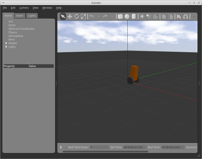
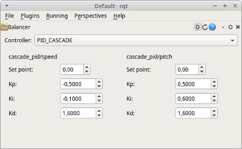

# Two wheeled self-balancing robot playground

This is environment for self-balancing robot. It consists of simulation model and examples of control algorithms.


## Features

- use of Robot Operating System (ROS)
- integration with Gazebo
- use of ```rqt_plot``` (*src/self-balancer/balancer-driver/plot\*.sh*)
- how to interact with ROS using Python (publishers and subscribers) -- *src/self-balancer/balancer-driver*
- how to prepare GUI for ```rqt``` using *Qt* and Python  -- *src/self-balancer/balancer-rqt*


## Screens

[](doc/screens/gazebo-teeterbot.png)
[](doc/screens/balancer-rqt.png)

1. Gazebo view of *TeeterBot* environment
2. *Balancer*'s GUI


## How to build:

1. configure catkin workspace by calling script: *initialize_workspace.sh*
2. start virtual environment by *startenv.sh*
3. build packages by *make.sh*


## How to run:

For every command start virtual environment. Open new command lines with following programs:
1. start core: ```roscore```
2. launch TeeterBot simulation by *src/teeterbot/run_empty.sh*
3. start *self-balancer* driver by *src/self-balancer/balancer-driver/src/drive*
4. (optional) start *self-balancer* control GUI by ```rqt```
5. (optional) run one of plotters *src/self-balancer/balancer-driver/plot\*.sh* to observer inputs and outputs


## Packages

Playground consists of following packages:
1. [self-balancer](src/self-balancer/README.md) -- varius control algorithms for the robot
2. [TeeterBot](src/teeterbot/README.md) -- self-balancing robot simulation model. Source repository can be found here: https://github.com/robustify/teeterbot


## Requirements

Environemnt was tested with following dependencies:
- ROS Melodic
- Gazebo 9.9.0
- Python 2.7.15+ (for ROS)
- Python 3.6.8 (for *self-balancer*)
- numpy 1.17.0
